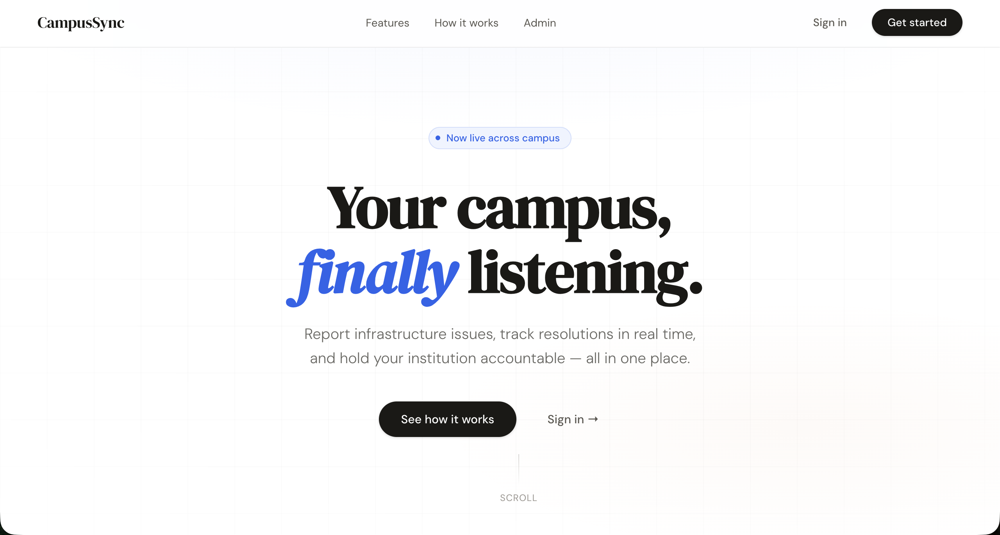
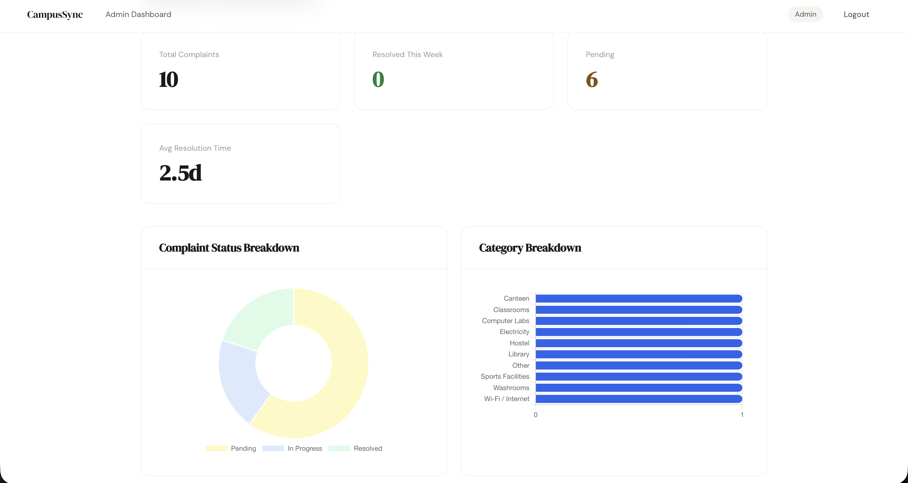
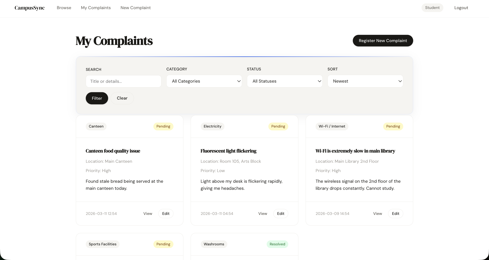
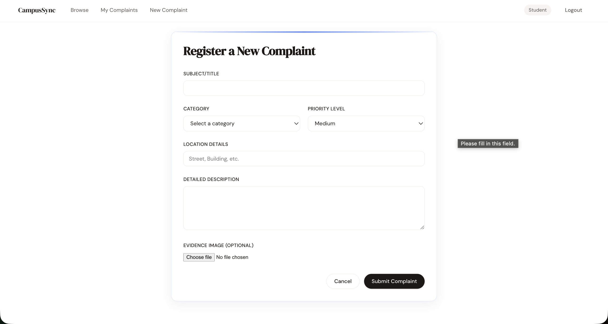
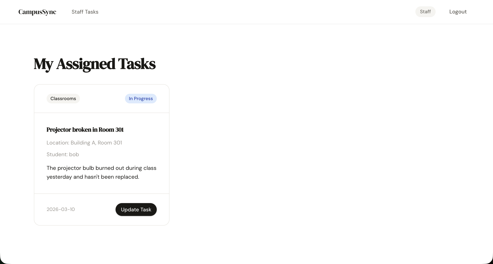

# CampusSync — College Complaint Management System

> **Live Demo:** [https://campussync-1668.onrender.com](https://campussync-1668.onrender.com)

A Flask-based web application built to solve a real institutional problem — untracked, unresolved student complaints that fall through the cracks in college administration. CampusSync gives students a structured channel to raise issues and gives administrators full visibility and control over resolution.

## App Preview

| Landing Page | Admin Dashboard |
| :---: | :---: |
|  |  |

| All Complaints | New Complaint | Staff Dashboard |
| :---: | :---: | :---: |
|  |  |  |

---


## Features

- **Role-based Access Control**: Three user roles — Admin, Staff, and Student
- **Complaint Workflow**: Submit → Assign → Resolve complaint lifecycle
- **Email Domain Restriction**: Only @asmedu.org emails allowed for ASM CSIT branding
- **Soft Delete**: Admin can delete complaints without permanent data loss
- **File Uploads**: Support for complaint evidence image attachments
- **Upvoting & Comments**: Students can upvote and comment on complaints
- **Dashboard Analytics**: Charts for complaint status and category breakdown
- **Search & Filtering**: Filter complaints by status and category
- **Responsive UI**: Custom vanilla CSS with dark mode support
- **Production Ready**: Includes Gunicorn for deployment

## Technology Stack


---


## Installation & Setup

### Prerequisites
- Python 3.9+
- pip package manager

### Quick Start

1. **Clone and navigate to the project**:
   ```bash
   git clone <repository_url>
   cd CampusSync
   ```

2. **Create and activate virtual environment**:
   ```bash
   python -m venv venv
   source venv/bin/activate       # On Windows: venv\Scripts\activate
   ```

3. **Install dependencies**:
   ```bash
   pip install -r requirements.txt
   ```

4. **Setup environment variables**:
   ```bash
   cp .env.example .env
   # Edit .env with your local configuration
   ```

5. **Seed the database with demo data**:
   ```bash
   python seed_db.py
   ```

5. **Run the application**:
   ```bash
   python run.py
   ```

6. **Access the application**:
   - Open http://localhost:8000 in your browser
   - Login with demo credentials (see below)

## Deployment

### Local Development
```bash
python run.py
```
The app runs on http://localhost:8000

### Production Deployment (Gunicorn)
```bash
gunicorn run:app
```
Or with specific settings:
```bash
gunicorn --workers 4 --bind 0.0.0.0:8000 run:app
```

### Environment Variables for Production
```bash
export SECRET_KEY="your-production-secret-key"
export FLASK_ENV="production"
```

## Demo Credentials

| Role    | Email                      | Password    |
|---------|----------------------------|-------------|
| Admin   | admin@asmedu.org           | admin123    |
| Staff   | it.support@asmedu.org      | staff123    |
| Student | alice.cs@asmedu.org        | student123  |

## User Roles & Permissions

### Student
- Register new complaints with category, priority, location, and description
- Upload evidence image files
- Upvote and comment on complaints
- View and edit own pending complaints
- Track complaint status in real time

### Staff
- View complaints assigned to them
- Update complaint status (In Progress → Resolved)
- Access complaint details and evidence images

### Admin
- View all complaints with status and category filtering
- Assign complaints to staff members
- Delete complaints (soft delete)
- View dashboard analytics (status chart, category chart)
- Click stat cards to see Pending / Resolved complaint lists

## Complaint Categories

- Wi-Fi / Internet
- Classrooms
- Computer Labs
- Canteen
- Washrooms
- Library
- Hostel
- Sports Facilities
- Electricity
- Other

## Complaint Status Workflow

1. **Pending** — New complaint submitted by student
2. **In Progress** — Assigned to a staff member by admin
3. **Resolved** — Marked complete by assigned staff

## Project Structure

```
CampusSync/
├── app/
│   ├── __init__.py          # Flask application factory
│   ├── models.py            # Database models (User, Complaint, Comment, Vote)
│   ├── auth.py              # Authentication blueprint
│   ├── student.py           # Student dashboard blueprint
│   ├── admin.py             # Admin dashboard blueprint
│   ├── staff.py             # Staff dashboard blueprint
│   ├── static/              # CSS, JS, uploaded files
│   └── templates/           # Jinja2 templates per role
├── instance/                # Local SQLite database
├── config.py                # Application configuration
├── run.py                   # Development server entry point
├── seed_db.py               # Database initialization & seeding script
└── requirements.txt         # Python dependencies
```

## Key Features Demonstrated

- **Flask Application Factory Pattern**: Modular, scalable architecture
- **SQLAlchemy ORM**: Database abstraction and relationships
- **Blueprint Organization**: Clean separation of concerns per role
- **Form Validation**: WTForms with CSRF protection
- **File Upload Security**: UUID naming and type validation
- **Role-based Permissions**: Flask-Login integration
- **Chart.js Integration**: Visual analytics on admin dashboard
- **Soft Delete Pattern**: Data integrity preservation

## Development Notes

- Uses SQLite for simplicity (easily replaceable with PostgreSQL for production)
- Email domain validation enforces ASM CSIT branding
- CSRF protection on all forms
- Session-based authentication
- Error handling with custom 403/404/500 pages

## Why CampusSync Exists

In most institutions, student complaints are handled informally — emails get lost, verbal complaints are forgotten, and nothing is tracked. CampusSync solves this by:
- Giving every complaint a trackable lifecycle: **Pending → In Progress → Resolved**
- Letting students upvote issues so high-impact problems are prioritised
- Giving admins a real-time dashboard with analytics to spot recurring problems
- Ensuring accountability by assigning complaints to specific staff members
- Preserving data integrity with soft deletes and role-based access control

## Future Enhancements

- **Email Notifications**: Notify students when their complaint status changes
- **SLA Tracking**: Auto-escalate high-priority complaints unresolved after 48 hours
- **Machine Learning Categorisation**: Auto-tag complaint descriptions using NLP
- **PWA Support**: Convert to a Progressive Web App for mobile use

## License

This project is open-source and built to address real institutional needs. Contributions and adaptations for other institutions are welcome.
